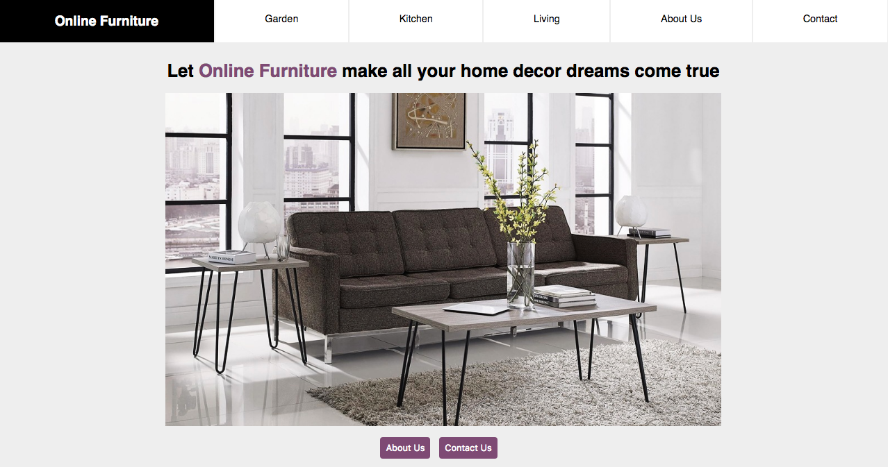

# Furniture E-commerce Store

Project uses React to create a simple SPA for an online furniture store. For this project I practiced working off a wireframe and the site's home page design is based on the design of this site: http://coolmaterial.com/home/best-online-furniture-stores/

Dependencies needed for the project:
`npm install react-router-dom`

## Future Goals:
- [ ] Responsive Design for Mobile
- [ ] Cart page where customers can save a shopping list

Home Page:

